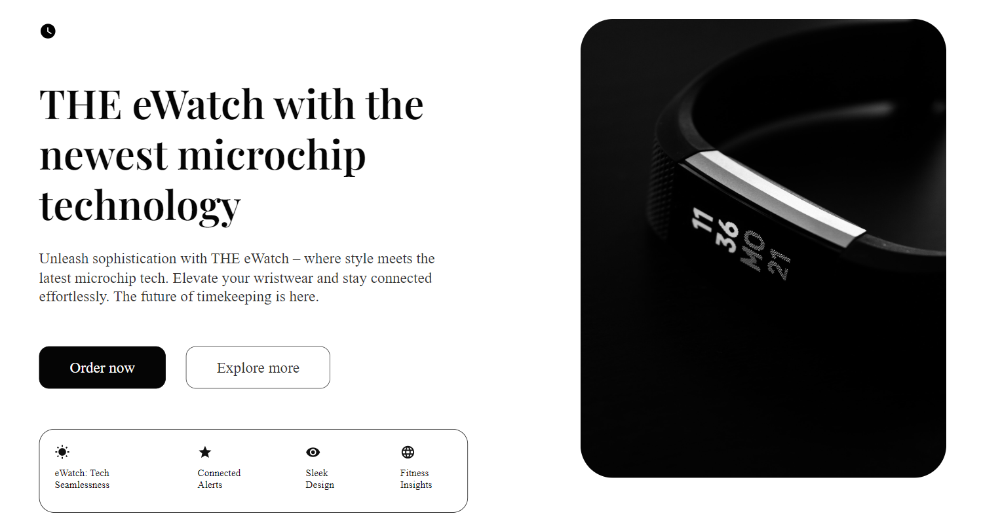

# eWatch Showcase
[Live Here](https://65857e8430feeec5d2925ccb--delicate-tarsier-856e9b.netlify.app/)

Welcome to the eWatch Showcase, a React and TypeScript project designed to feature THE eWatch. This repository contains the source code for the website.

## Features:

- **React Components:** The project is built using React, providing a modular and component-based structure.

- **TypeScript Integration:** TypeScript is used to enhance code quality and provide static typing for a more robust development experience.

- **Responsive Design:** The website is fully responsive, ensuring optimal user experience on various devices.

- **Interactive UI:** Leveraging React's component lifecycle and state management for an interactive and dynamic user interface.

## Usage:

1. Clone the repository: `git clone https://github.com/your-username/eWatch-Showcase.git`
2. Navigate to the project directory: `cd eWatch-Showcase`
3. Install dependencies: `npm install`
4. Run the application: `npm start`
5. Open your browser and visit `http://localhost:3000`

## Contributing:

Contributions are welcome! If you have suggestions, find bugs, or want to add new features, feel free to open an issue or submit a pull request.

## Tech Stack:

- React
- TypeScript
- HTML
- CSS

## License:

This project is licensed under the MIT License - see the [LICENSE](LICENSE) file for details.

Enjoy exploring and showcasing THE eWatch in style!
